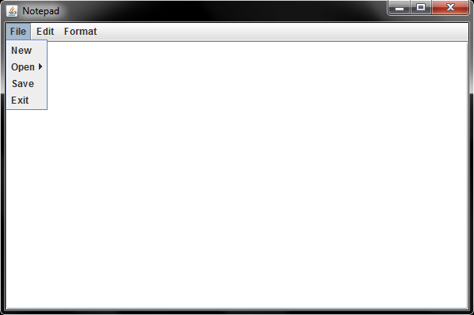
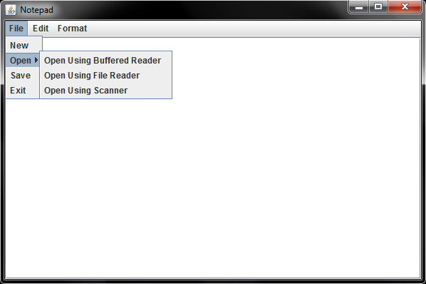
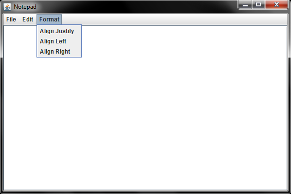
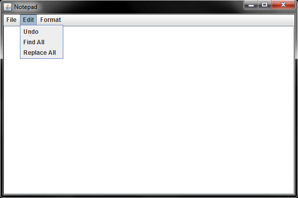
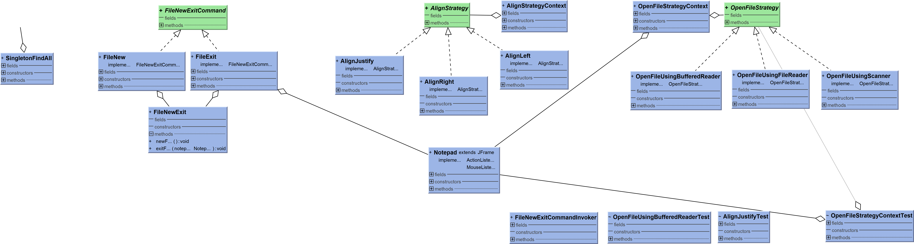

# Notepad

Notepad - 2019 (Java)

Notepad is a text editor application with design patterns.

It supports:

<ul>
  <li>Creating, opening, closing, and saving files</li>
  <li>Finding and replacing a word in the text</li>
  <li>Aligning left, right, or justify the selected text</li>
</ul>

<h2>Design Patterns</h2>

The application contains four design patterns.

The command design pattern provides two functionalities. One of them creates an empty window by the "New" button. Another one terminates the application by the "Exit" button.

The iterator design pattern provides command iteration for the command pattern in the "FileNewExitCommandInvoker.java" class.

The strategy design pattern provides two functionalities. One of them opens an existing text file with Buffered Reader, File Reader, or Scanner functions. Another one aligns the selected text left, right, or justify.

The singleton design pattern provides to open "Find All" window for once.

<h2>Unit Tests</h2>

The application contains three unit tests.

<ul>
  <li>"AlignJustifyTest.java" for "AlignJustify.java"</li>
  <li>"OpenFileStrategyContextTest.java for "OpenFileStrategyContext.java"</li>
  <li>"OpenFileUsingBufferedReaderTest.java" for "OpenFileUsingBufferedReader.java"</li>
</ul>

<h2>UML</h2>

Notepad doesn't require installation but does need to pre-installed Java.

<a href="https://github.com/onursert/Notepad/raw/master/Notepad.jar">Download Notepad</a>
